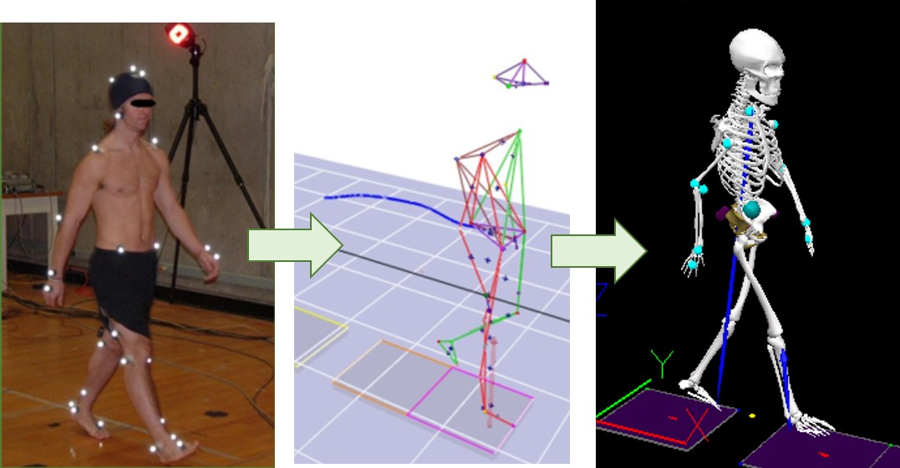

```{r setup, include=FALSE}
library("rio")
library("here")
library("tidyverse")
library("janitor")
library("knitr")
library("fs")

knitr::opts_chunk$set(warning = FALSE,
                      message = FALSE,
                      error = TRUE,
                      fig.width = 6.5,
                      fig.height = 8
                      )
theme_set(theme_minimal(base_size = 8))

```


## What's this project about?

The main purpose of the project is to calculate two outcome variables indicating human **joint-joint coordination** and **variability of coordination** during body movement. These two variables ared called *inter-joint continuous relative phase (CRP)* and *deviation phase (DP)*, respectily. They are widely used in the field of biomechanics, but to our knowlege there is no R function/package avalible designed for it. 


### Description of data

The data was collected in the Motion Analysis Lab at UO. Five participants were recruited. They were asked to perform level walking on a 15-m straight walkway for a couple times. A 12-camera motion analysis system with a set of 40 reflective markers was used to record the whole body movement during walking (Figure 1, left). From the marker trajectories (Figure 1, middle), 3-D human model was created (Figure 1, right) and **joint data** was then calculated for further analysis.  

  

The goal of project is to create a shiny dashboard, which 1) prints the CRP and DP values, and 2) prints plots like Figure 2.  

 

## Data Preparation

### Import data

```{r import_data}

files <- dir_ls(here("data"), glob = "*.txt")
batch <- map_df(files, import, setclass = "tbl_df", .id = "file")
head(batch, 20L)

```

The **bacth** has data from 5 subjects.  

Each subject has upto 5 trials, representing 5 times of walking.  

Each trial generates 6 outcome variables, including:  

* **hip angle**  
* **hip velocity**  
* **knee angle**  
* **knee velocity**  
* **ankle angle**   
* **ankle velocity**  

Each variable has 101 datapoints (rows), representing 0%-100% of walking cycle.

There are couple issues to be solved before we can do the further analysis:  

1. Column names (variable names) are meaningless. They are V1 to V31.
2. The first 4 rows of each iteration (subject) contain information we want:
 + **trial**:  from trial 1 upto trial 5.
 + **outcome measurement**: angle or velocity of hip, knee, and ankle

### Tidy data

One function (tidy_for_v) is to  

1. turn meaningless names to meaningful names, representing each **outcome measurement** and 
2. extract **trial** information . It takes data of 1 measurment as input.  

Another function (tidy_for_subject) is to apply aforementioned function to all meaningless variables (V2-V31). It takes data of 1 subject as input.

```{r tidy_data}

##-----------function 01: tidy data, using 1 vector (measurement) as input-----##

tidy_for_v <- function(v){
  v <- v %>% 
  mutate(var = value[2],
         trial = value[1],
         trial = str_replace_all(trial, ".c3d", ""),
         trial = str_replace_all(trial, "(......)_", ""),
         var = tolower(var)) %>%
  rename(frame = V1) %>% 
  slice(-1:-5) %>% 
  dplyr::select(trial, var, frame, value) 
}


##------------function 02: tidy data, using 1 subject's data as input---------------##
##------------note: this function has another function(tidy_for_v) inside--------##

tidy_for_subject <- function(data){
  data_from_one_subject <- data %>% 
    gather(temvar, value, V2:V31) %>% 
    group_by(temvar) %>% 
    nest() %>% 
    mutate(tidy = map(data, tidy_for_v)) %>% 
    dplyr::select(-data) %>%
    unnest() 
}


tidy <- batch %>% 
  mutate(file = str_replace_all(file, here("data"), ""),
         id = parse_number(file)) %>% 
  select(id, everything(), -file) %>% 
  group_by(id) %>%
  nest() %>% 
  mutate(new_data = map(data, tidy_for_subject)) %>% 
  dplyr::select(-data) %>%
  unnest() %>%
  dplyr::select(-temvar) %>%
  filter(!is.na(value)) %>% 
  mutate(id = as.factor(id),
         trial = as.factor(trial),
         var = factor(var, levels = c("right_hip_angle", "right_hip_velocity", 
                                      "right_knee_angle", "right_knee_velocity", 
                                      "right_ankle_angle", "right_ankle_velocity"),
                      labels = c("hip angle", "hip velocity",
                                 "knee angle", "knee velocity",
                                 "ankle angle", "ankle velocity")),
         frame = as.factor(frame),
         value = as.numeric(value))


head(tidy, 20L)
str(tidy)
```

## Data Analysis

### Built phase portrait

Phase portrait is to plot the normalized angular positions $\Theta$ (x-axis) and normalized angular velocities $\omega_{i}$ (y-axis). Angular positions and velocities were normalized using the following equations, where $\Theta_{i}$ and $\omega_{i}$ are the angular position and velocity for 101 data points during a walking cycle.  
  
  $$\Theta_{i}=\frac{2*[\Theta_{i}-min(\Theta_{i})]}{max(\Theta_{i})-min(\Theta_{i})}-1$$
  $$\omega_{i}=\frac{\omega_{i}}{max(\omega_{i})} $$  
  
```{r normalize}

##----------function 03: to normalize angle---------##

normalize_angle <- function(angle){
  
norm_angle_data <- angle %>% 
  mutate(norm_angle = (2* (value - min(value))/(max(value) - min(value))) - 1,
         max_angle = max(norm_angle),
         min_angle = min(norm_angle)) %>% 
  rename(raw_angle = value)
}

## may consider using NSE here, substitue "value"

# group_means <- function(data, frame, angle) {
#     frame <- enquo(frame) # Quote the inputs
#     value <- enquo(angle)
#     
#     data %>% select(!!value) %>%
#      mutate(norm_angle = (2* (value - min(value))/(max(value) - min(value))) - 1,
#          max_angle = max(norm_angle),
#          min_angle = min(norm_angle)) %>% 
#     rename(raw_angle = value)
#         
# }


##-------------function 04: to normalize velocity----------##

normalize_velocity <- function(velocity){
  
norm_velocity_data <- velocity %>% 
  mutate(norm_velocity = value /max(abs(value)),
         max_velocity = max(norm_velocity),
         min_velocity = min(norm_velocity)) %>% 
  rename(raw_velocity = value)
  
}

normalize <- tidy %>% 
  separate(var, into = c("joint", "measure")) %>% 
  group_by(id, trial, joint, measure) %>% 
  nest() %>% 
  spread(measure, data) %>% 
  mutate(norm_angle = map(angle, normalize_angle),
         norm_velocity = map(velocity, normalize_velocity)) %>% 
  dplyr::select(-angle, -velocity) %>% 
  unnest() %>% 
  dplyr::select(-frame1)

head(normalize)
```


```{r phase_portrait}

## add ggplot labs ##

phase_plot <- normalize %>%
  group_by(id, trial, joint) %>%
  nest() %>%
  mutate(phase_plot = map(data, function(data){
    
                data %>% ggplot(aes(norm_angle, norm_velocity)) +
                           geom_point() +
                           geom_path() +
                           geom_point(data = filter(data, frame == 1), 
                                     color = "red", size = 3) +
                           geom_vline(xintercept = 0, color = "gray50") +
                           geom_hline(yintercept = 0, color = "gray50")

                          }))


head(phase_plot)
phase_plot$phase_plot[[1]]  ## example plot

```


### Calculate phase angle

Phase angle($\varphi$) is calculated using the below equation along each data point and unwrapped to correct discontinuities occurred during angle computation.  


 $$\varphi = \tan^{-1}(\frac{\omega}{\theta }) $$

```{r phase_angle}

phase_angle <- phase_plot %>% 
  mutate(phase_angle = map(data, function(data){
    
    tibble(frame = seq(1, 101, 1),
           phase_angle = signal::unwrap((atan2(data$norm_velocity, data$norm_angle))) * 180 / pi)
    
    
  })) %>% 
  select(-phase_plot, -data) %>% 
  unnest() 


head(phase_angle)

```

### Plot time-series phase angle plot

```{r phase_angle_plot}


phase_angle_plot <- phase_angle %>% 
  group_by(id, trial, joint) %>% 
  nest() %>% 
  mutate(phase_angle_plot = map(data, function(data){
    
    data %>%
      ggplot(aes(x = frame, y = phase_angle)) +
      geom_point()
    
  }))

head(phase_angle_plot)
phase_angle_plot$phase_angle_plot[[1]] ## example plot

```


### Calculate hip-knee CRP

CRP is obtained by subtracting the phase angles of distal joint from that of proximal joint as follows. CRP identifies the coordination between two adjacent joints.
  
  $$CRP_{hip\cdot knee}=\varphi_{hip} - \varphi_{knee}$$
 
 
```{r crp_hipknee}

head(phase_angle)

crp_hipknee <- phase_angle %>% 
  filter(joint == "hip" | joint == "knee") %>% 
  spread(joint, phase_angle) %>% 
  mutate(crp_hipknee = hip - knee)


head(crp_hipknee)
```


```{r crp_hipknee_plot}


crp_hipknee_plot <- crp_hipknee %>% 
  group_by(id, trial) %>% 
  nest() %>% 
  mutate(crp_hipknee_plot = map(data, function(data){
    
    data %>% 
      ggplot(aes(x = frame, y = crp_hipknee)) +
      geom_point()
    
  }))

head(crp_hipknee_plot)
crp_hipknee_plot$crp_hipknee_plot[[1]] ## example plot
```

### Calculate knee-ankle CRP

Similarly, knee-ankle CRP is obtained using the following eqution: 

 $$CRP_{knee\cdot ankle}=\varphi_{knee} - \varphi_{ankle}$$
  


```{r crp_kneeankle}

crp_kneeankle <- phase_angle %>% 
  filter(joint == "knee" | joint == "ankle") %>% 
  spread(joint, phase_angle) %>% 
  mutate(crp_kneeankle = knee - ankle)

head(crp_kneeankle)
```

```{r crp_kneeankle_plot}


crp_kneeankle_plot <- crp_kneeankle %>% 
  group_by(id, trial) %>% 
  nest() %>% 
  mutate(crp_kneeankle_plot = map(data, function(data){
    
    data %>% 
      ggplot(aes(x = frame, y = crp_kneeankle)) +
      geom_point()
    
  }))

head(crp_kneeankle_plot)
crp_kneeankle_plot$crp_kneeankle_plot[[1]]  ## example plot


```

### Calculate DP

DP is the average value of all standard deviations calculated for each data point over a walking cycle from upto five CRP curves as follows.  

$$mean(std(CRP_{i}))$$  


```{r}

dp <- crp_hipknee %>% 
  left_join(crp_kneeankle) %>% 
  group_by(id, frame) %>% 
  summarise(crp_hipknee_sd = sd(crp_hipknee),
            crp_kneeankle_sd = sd(crp_kneeankle)) %>% 
  group_by(id) %>% 
  summarise(dp_hipknee = mean(crp_hipknee_sd),
            dp_kneeankle = mean(crp_kneeankle_sd))

head(dp)
```

To do list: 

1. Add **id**, **trial**, **angle** information in each plot
2. Combine plots from **phase_plot**, **phase_angle_plot**, **crp_hipknee_plot**, **crp_kneeankle_plot**
